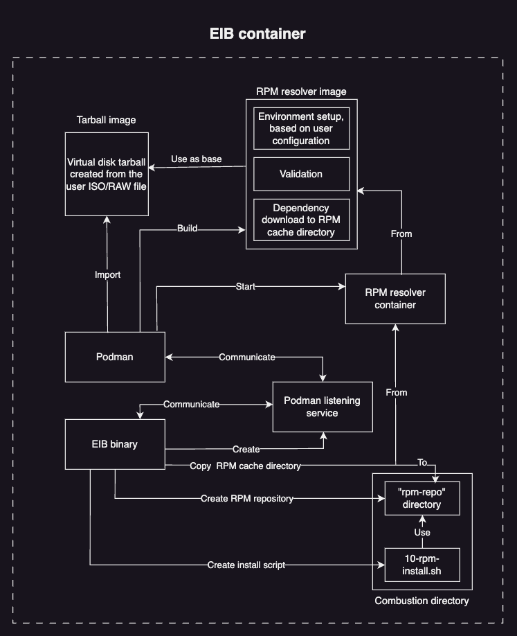

# Installing packages
This documentation aims at explaining how a user can configure packages for installation and dependency resolution. Furthermore it delves deeper into the **RPM resolution** process that EIB goes through so that it can prepare and install user defined pacakges. 

Below you can find a table of contents for easier navigation through this doc:

1. [Supported systems](#supported-systems)
2. [Configure packages for installation](#configure-packages-for-installation)
    * [Install packages through 'packageList'](#install-packages-through-packagelist)
        * [Install a package from a third-party repo](#install-a-package-from-a-third-party-repo)
        * [Install a package from SUSE's internal repositories](#install-a-package-from-suses-internal-repositories)
    * [Side-load RPMs](#side-load-rpms)
        * [RPM with dependency resolution from a third-party repository](#rpm-with-dependency-resolution-from-a-third-party-repository)
        * [RPM with depdendency resolution from SUSE's internal repositories](#rpm-with-depdendency-resolution-from-suses-internal-repositories)
    * [Installing unsigned packages](#installing-unsigned-packages)
3. [Package installation workflow](#package-installation-workflow)
    * [Running the EIB container](#running-the-eib-container)
    * [Building the EIB image](#building-the-eib-image)
        * [RPM resolution process](#rpm-resolution-process)    
        * [Troubleshooting](#troubleshooting)
    * [Booting the EIB image](#booting-the-eib-image)

## Supported systems
The RPM package dependency resolution and installation has been tested on the following systems:  
1. [Ubuntu 22.04](https://releases.ubuntu.com/jammy/)
2. [SLES 15-SP5](https://www.suse.com/download/sles/)
3. [openSUSE Tumbleweed](https://get.opensuse.org/tumbleweed/)
4. [Fedora Linux](https://fedoraproject.org/workstation/download)

## Configure packages for installation
You can configure packages for installation in the following ways:
1. provide a `packageList` configuration under `operatingSystem.packages` in the EIB image configuration file
2. create a `rpms` directory under EIB's configuration directory and provide local RPM files that you wish to be resolved and installed

### Install packages through 'packageList'
To install a package using the `packageList` configuration, at a minimum you must configure the following under `operatingSystem.packages`:
1. valid package names under `packageList`
2. either an `additionalRepo` or a `registrationCode` provided

Below you can find examples for the aforementioned use cases.

#### Install a package from a third-party repo
```yaml
operatingSystem:
  packages:
    packageList:
      - reiserfs-kmp-default-debuginfo
    additionalRepos:
      - url: https://download.opensuse.org/repositories/Kernel:/SLE15-SP5/pool
```
> **_NOTE:_** Before adding any repositories under `additionalRepos`, make sure that they are signed with a valid GPG key. Otherwise the EIB package resolution will fail.

#### Install a package from SUSE's internal repositories
```yaml
operatingSystem:
  packages:
    packageList:
      - wget2
    registrationCode: <your-reg-code>
```

### Side-load RPMs
Sometimes you may want to install RPM files that are local to your machine. You can do this by creating a directory called `rpms` under `<eib-config-dir>/rpms` and copy your local RPM files to this directory.

If your RPMs are dependent on other packages, then you must provide either an entry under `additionalRepos` or a `registrationCode` property.

> **_NOTE:_** All RPMs that will be side-loaded must have valid GPG signatures. The GPG keys used to sign the RPMs must be copied to the `gpg-keys` directory which must be created under `<eib-config-dir>/rpms`. If you try to install RPMs that are unsgined or have unrecognized GPG keys, the EIB package resolution will fail.

#### RPM with dependency resolution from a third-party repository  
EIB configuration directory tree:
```shell
.
├── eib-config-iso.yaml
├── images
│   └── SLE-Micro.x86_64-5.5.0-Default-RT-GM.raw
└── rpms
    ├── gpg-keys
    │   └── reiserfs-kpm-default-debuginfo.key
    └── reiserfs-kmp-default-debuginfo-5.14.21-150500.205.1.g8725a95.x86_64.rpm
```

EIB config file `packages` configuration:
```yaml
operatingSystem:
  packages:
    registrationCode:
      - url: https://download.opensuse.org/repositories/Kernel:/SLE15-SP5/pool
```

#### RPM with depdendency resolution from SUSE's internal repositories
EIB configuration directory tree:
```shell
.
├── eib-config-iso.yaml
├── images
│   └── SLE-Micro.x86_64-5.5.0-Default-RT-GM.raw
└── rpms
    ├── gpg-keys
    │   └── git.key
    └── git-2.35.3-150300.10.33.1.x86_64.rpm
```

EIB config file `packages` configuration:
```yaml
operatingSystem:
  packages:
    additionalRepos: <your-reg-code>
```

### Installing unsigned packages
By default EIB does GPG validation for every additional repository and side-loaded RPM. If you wish to use unsigned additional repositories and/or unsinged RPMs you must add the `noGPGCheck: true` property to the `packages` configuration in the EIB configration file, like so:
```yaml
operatingSystem:
  packages:
    noGPGCheck: true
```
By doing this **all** GPG validation will be **disabled**.

> **_NOTE:_** This property is intended for development purposes only. For production use-cases we encourage users to not disable EIB's GPG validation.

## Package installation workflow
The package installation workflow can be separated in three logical parts:
1. *Running the EIB container* - how to run the EIB container so that the **RPM resolution** has the needed permissions
2. *Building the EIB image* - what happens during the **RPM resolution** logic
3. *Booting the EIB image* - how are the packages actually installed once the EIB image boots for the first time

### Running the EIB container


The package installation workflow begins with the user configuring packages and/or stand-alone RPMs that will be installed when the EIB image is booted. On how to to do a correct configuration, see [Configure packages for installation](#configure-packages-for-installation).

After the desired configuration has been made, the user runs the EIB container with the [`--privileged`](https://docs.podman.io/en/latest/markdown/podman-run.1.html#privileged) option. By doing this, we ensure that EIB has the needed permissions to successfully run a Podman instance within its container. This is a crutial prerequisite for building a working EIB image with package installation configured (more on this in the next section). 

An example of the command can be seen below:
```shell
podman run --rm --privileged -it \
-v $IMAGE_DIR:/eib eib:dev /bin/eib \
-config-file $CONFIG_FILE.yaml \
-config-dir /eib \
-build-dir /eib/_build
```

> **_NOTE:_** Depending on the `cgroupVersion` that podman operates with, you might also need to run the command with `root` permissions. This is the case for `cgroupVersion: v1`, mainly because the `--privileged` option does not support non-root usage for this version. For `cgroupVersion: v2`, you can run the command without `root` permissions. In order to check the `cgroupVersion` that podman operates with, run the command `podman info | grep cgroupVersion`.

Once the EIB container has been successfully executed, it parses all the user provided configuration and begins the **RPM resolution** process. 

### Building the EIB image
Here EIB prepares the user configured packages for installation. This process is called **RPM resolution** and it includes:
1. Validating that each provided package has a GPG signature or comes from a GPG signed RPM repository
2. Resolving and downloading the dependencies for each configured package
3. Creating a RPM repository consisting of the configured packages and their dependencies
4. Configure the usage of this repositry for package installation during the **combustion** phase of the EIB image boot

Below you can find a more detailed description of EIB's **RPM resolution** process. 

#### RPM resolution process


EIB mainly utilizes Podman's functionality to setup the environment needed for the **RPM resolution** process. In order to communicate with Podman, EIB first creates a [listening service](https://docs.podman.io/en/latest/markdown/podman-system-service.1.html) that will faciliate the communication between EIB and Podman. From here onwards, asume that any Podman related operation that EIB does goes through the **listening service** first.

Once EIB establishes communication with Podman, it parses the user configured ISO/RAW file and converts it to a Podman importable **virtual disk tarball**. This tarball is [imported](https://docs.podman.io/en/stable/markdown/podman-import.1.html) as an image in Podman. 

EIB then proceeds to build the **RPM resolver** image using the **tarball image** as a base. This procedure ensures that the validation/resolution of any packages that are configured for installation will be as close to the desired user environment as possible.

All the RPM resolution logic is done during the build of the **RPM resolver** image. This includes, but is not limited to:
1. Connecting to SUSE's internal RPM repositories, if configured by the user through `operatingSystem.packages.registrationCode`
2. Importing any GPG keys provided by the user under `<eib-config-dir>/rpms/gpg-keys`
3. Validating any RPM files provided by the user under `<eib-config-dir>/rpms`
4. Adding and validating any third-party RPM repositories, if configured by the user through `operatingSystem.packages.additionalRepos`
5. Creating a **RPM cache directory** and downloading the dependencies for all configured packages and side-loaded RPMs to it.

After a successful image build, EIB starts a container from the newly built image and copies the aforementioned **RPM cache directory** to the **combustion** directory located in the EIB container. This cache directory is then converted to a ready to use RPM repository by EIB.

The final step in the EIB **RPM resolution** process is to create a  **combustion script** which uses the aforementioned RPM repository to install the user configured packages during the EIB image combustion phase.

#### Troubleshooting
When troubleshooting the **RPM resolution** process, it is beneficial to look at the following files/directories inside of the EIB build directory:
1. `eib-build.log` - general logs for the whole EIB image build process
2. `podman-image-build.log` - logs for the build of the EIB resolver image. If missing, but the `resolver-image-build` directory is present, this means that there is a problem in the configuration of the `resolver-image-build` directory
3. `podman-system-service.log` - logs for the Podman listening service
4. `resolver-image-build` directory - build context for the resolver image. Make sure that the `Dockerfile` holds correct data. When installing side-loaded RPMs, make sure that the `rpms` and `gpg-keys` directories are present in the `resolver-image-build` directory
5. `resolver-base-image` direcotry - contains resources related to the creation of the **virtual disk tarball** archive. If this directory exists, this means that a problem has been encountered while EIB was trying to import the **tarball image**
6. `prepare-base.log` - logs related to the creation of the **virtual disk tarball**
7. `createrepo.log` - logs related to converting the **RPM cache directory** to a **RPM repository**
8. `combustion/rpm-repo` directory - the **RPM repository**; should hold the desired RPMs for installation and their dependencies
9. `combustion/10-rpm-install.sh` - script that will be executed during the **combustion** phase

### Booting the EIB image
During the combustion phase of the EIB image boot, as mentioned above, both the **RPM repository** and **RPM combustion script** will be present in the combustion [configuration directory](https://github.com/openSUSE/combustion?tab=readme-ov-file#combustion) respectively under `/dev/shm/combustion/config/10-rpm-install.sh` and `/dev/shm/combustion/config/rpm-repo`.

The root combustion script then calls the `10-rpm-install.sh` script, which does the following:
1. Adds the `rpm-repo` directory as a local RPM repository to it package manager (`zypper`)
2. Installs the desired packages from the newly added `rpm-repo` RPM repository (`zypper in -r`)
3. Once all packages have been installed it removes the `rpm-repo` from the package manager (`zypper rr`)

The successful execution of the `10-rpm-install.sh` script indicates that all packages have been installed on the operating system. 