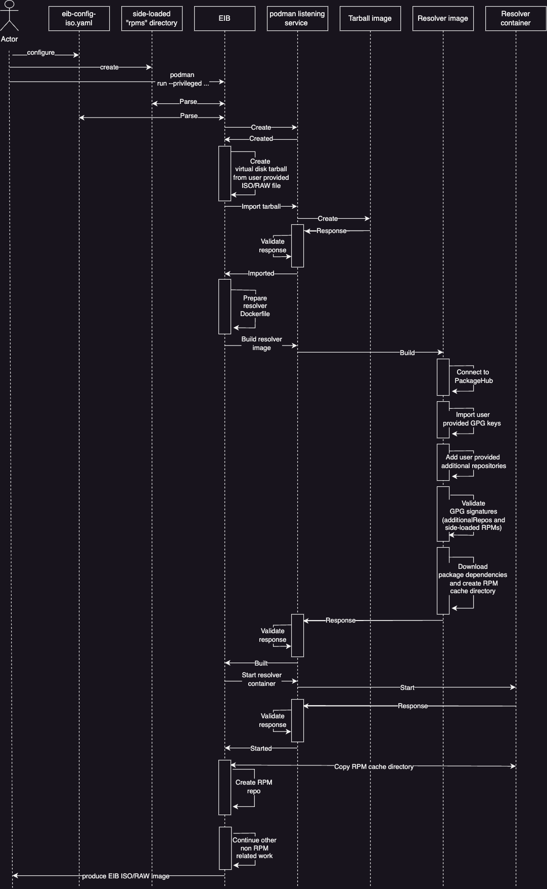

# RPM resolver architecture
The following documentation aims at explaining the workflow that EIB goes through in order to install RPM packages and dependencies in both air-gapped and non air-gapped environments.

## Architecture overview

EIBs RPM resolver architecture starts by having Podman installed on the EIB container. From there the EIB binary creates a [listening service](https://docs.podman.io/en/latest/markdown/podman-system-service.1.html) that will faciliate the communication between EIB and Podman.

Once the communication has been established, EIB takes the user configured ISO/RAW file and converts it to a Podman importable **virtual disk tarball**. This tarball is [imported](https://docs.podman.io/en/stable/markdown/podman-import.1.html) as an image in Podman. 

EIB then builds the **RPM resolver image** using the imported image as a base. The aforementioned procedure ensures that any validation/resolution of any packages that are configured for installation will be as close to the desired user environment as possible. 

All the RPM resolution logic and validation is done during the build of the **RPM resolver image**. This includes, but is not limited to:
1. Validating the GPG signatures of side-loaded RPMs
2. Validating the GPG signatures of third-party repositories
3. Creating a **RPM cache directory** and downloading the dependencies for all configured packages and side-loaded RPMs to it.

After a successful image build, EIB communicates to the podman listening service to start a container from the newly built image. Once started, EIB copies the aforementioned **RPM cache directory** to its local **combustion** directory and converts it to a ready to use RPM repository.

During the combustion phase, the configured packages and side-loaded RPMs will be installed from the aforementioned RPM repository. This effectively ensures that even in an air-gapped environment, the produced EIB image will have access to the packages that it needs to install along with all of their dependencies.

Below you can find a more structured diagram of the RPM resolution workflow starting from the EIB container and ending at the EIB image boot.

### RPM resolution workflow

The RPM resolution workflow begins with the user configuring the packages and/or stand-alone RPMs that will be installed when the image that EIB produces is booted. After configuring the desired packages the user runs the EIB container with the `--privileged` option. For more information on how to configure packages for installation, see [Installing packages](installing-packages.md).

